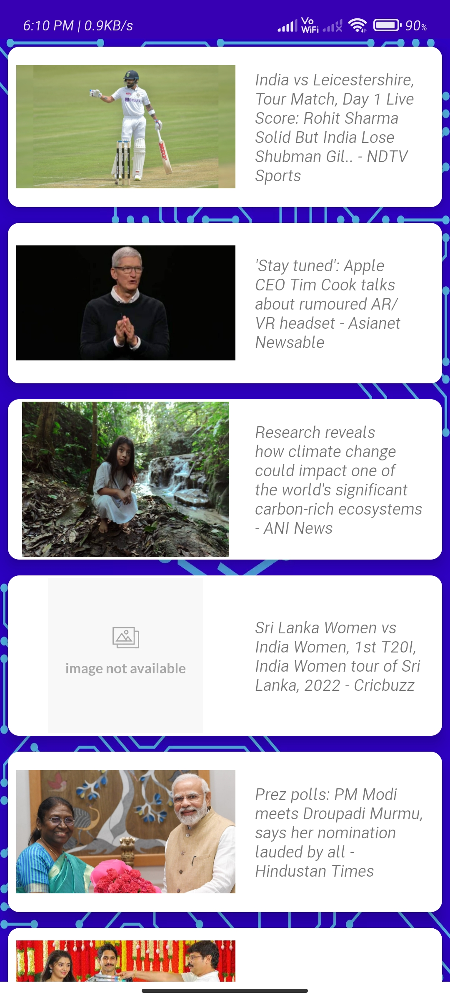

# Newzify-REST-API-NEWS-APP

Shows up-to-date NEWS using the <a href="https://newsapi.org/">NewsAPI.org</a> REST API 
------- **USES** --------
- <a href="https://square.github.io/retrofit/">Retrofit2 Library</a>
- <a href="https://github.com/bumptech/glide">Glide Library</a>
- ***Gson Convertor***
- RecyclerView
- View Binding

   
   :arrow_right:
  :arrow_right:
   
   :arrow_right:
   :arrow_right:
   

